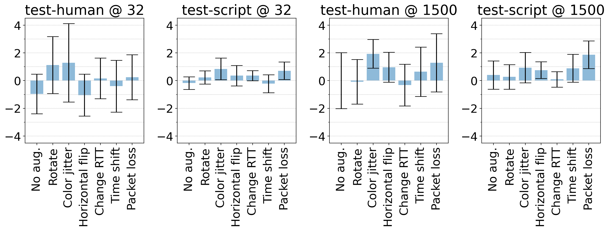

# Figure 10: Accuracy difference w/ and w/o Dropout in supervised learning.

[:simple-jupyter: :material-download:](../../paper_tables_and_figures/figure10_dropout_impact_supervised_setting/figure10_dropout_impact_supervised_setting.ipynb)


```python
import itertools
import pathlib

import matplotlib as mpl
import matplotlib.pyplot as plt
import numpy as np
import pandas as pd
import seaborn as sns
import statsmodels.stats.api as sms

%matplotlib inline
%config InlineBackend.figure_format='retina'
```


```python
RENAME = {
    "noaug": "No aug.",
    "rotate": "Rotate",
    "colorjitter": "Color jitter",
    "horizontalflip": "Horizontal flip",
    "changertt": "Change RTT",
    "timeshift": "Time shift",
    "packetloss": "Packet loss",
}
```


```python
folder = pathlib.Path(
    "./campaigns/ucdavis-icdm19/augmentation-at-loading-dropout-impact/campaign_summary/augment-at-loading-dropout-impact/"
)
```


```python
df = pd.concat(
    [
        pd.read_parquet(folder / f"runsinfo_flowpic_dim_{flowpic_dim}.parquet")
        for flowpic_dim in (32, 1500)
    ]
)
```


```python
df = df[
    [
        "flowpic_dim",
        "test_split_name",
        "aug_name",
        "seed",
        "split_index",
        "acc",
        "with_dropout",
    ]
]
```


```python
df = df[df["test_split_name"] != "test-train-val-leftover"]
df = df.replace(RENAME)
```


```python
df_with_dropout = (
    df[df["with_dropout"] == True]
    .drop("with_dropout", axis=1)
    .rename({"acc": "withdropout_acc"}, axis=1)
)

df_no_dropout = (
    df[df["with_dropout"] == False]
    .drop("with_dropout", axis=1)
    .rename({"acc": "nodropout_acc"}, axis=1)
)
```


```python
df = pd.merge(
    df_with_dropout,
    df_no_dropout,
    on=[
        "flowpic_dim",
        "test_split_name",
        "aug_name",
        "seed",
        "split_index",
    ],
    suffixes=["withdropout_", "nodropout_"],
)
```


```python
df = df.iloc[df["nodropout_acc"].dropna().index]
```


```python
df["acc_diff"] = df["withdropout_acc"] - df["nodropout_acc"]
```


```python
def compute_confidence_intervals(array, alpha=0.05):
    array = np.array(array)
    low, high = sms.DescrStatsW(array).tconfint_mean(alpha)
    mean = array.mean()
    ci = high - mean
    return ci
```


```python
df_merged = df.groupby(["flowpic_dim", "test_split_name", "aug_name"]).agg(
    {"acc_diff": ["mean", "std", "count", "min", "max", compute_confidence_intervals]}
)
df_merged = df_merged.rename(
    columns={"compute_confidence_intervals": "confidence_interval"}
)
df_merged = df_merged.droplevel(0, axis=1)
```


```python
df_merged
```


<div>
<style scoped>
    .dataframe tbody tr th:only-of-type {
        vertical-align: middle;
    }

    .dataframe tbody tr th {
        vertical-align: top;
    }

    .dataframe thead th {
        text-align: right;
    }
</style>
<table border="1" class="dataframe">
  <thead>
    <tr style="text-align: right;">
      <th></th>
      <th></th>
      <th></th>
      <th>mean</th>
      <th>std</th>
      <th>count</th>
      <th>min</th>
      <th>max</th>
      <th>confidence_interval</th>
    </tr>
    <tr>
      <th>flowpic_dim</th>
      <th>test_split_name</th>
      <th>aug_name</th>
      <th></th>
      <th></th>
      <th></th>
      <th></th>
      <th></th>
      <th></th>
    </tr>
  </thead>
  <tbody>
    <tr>
      <th rowspan="14" valign="top">32</th>
      <th rowspan="7" valign="top">test-human</th>
      <th>Change RTT</th>
      <td>1.606426e-01</td>
      <td>2.650081</td>
      <td>15</td>
      <td>-6.024096</td>
      <td>4.819277</td>
      <td>1.467566</td>
    </tr>
    <tr>
      <th>Color jitter</th>
      <td>1.285141e+00</td>
      <td>5.100786</td>
      <td>15</td>
      <td>-8.433735</td>
      <td>7.228916</td>
      <td>2.824721</td>
    </tr>
    <tr>
      <th>Horizontal flip</th>
      <td>-1.044177e+00</td>
      <td>2.727209</td>
      <td>15</td>
      <td>-4.819277</td>
      <td>6.024096</td>
      <td>1.510278</td>
    </tr>
    <tr>
      <th>No aug.</th>
      <td>-9.638554e-01</td>
      <td>2.584049</td>
      <td>15</td>
      <td>-4.819277</td>
      <td>2.409639</td>
      <td>1.430999</td>
    </tr>
    <tr>
      <th>Packet loss</th>
      <td>2.409639e-01</td>
      <td>2.922951</td>
      <td>15</td>
      <td>-3.614458</td>
      <td>6.024096</td>
      <td>1.618676</td>
    </tr>
    <tr>
      <th>Rotate</th>
      <td>1.124498e+00</td>
      <td>3.712572</td>
      <td>15</td>
      <td>-7.228916</td>
      <td>6.024096</td>
      <td>2.055954</td>
    </tr>
    <tr>
      <th>Time shift</th>
      <td>-4.016064e-01</td>
      <td>3.366931</td>
      <td>15</td>
      <td>-6.024096</td>
      <td>6.024096</td>
      <td>1.864544</td>
    </tr>
    <tr>
      <th rowspan="7" valign="top">test-script</th>
      <th>Change RTT</th>
      <td>3.555556e-01</td>
      <td>0.660287</td>
      <td>15</td>
      <td>-0.666667</td>
      <td>1.333333</td>
      <td>0.365655</td>
    </tr>
    <tr>
      <th>Color jitter</th>
      <td>8.444444e-01</td>
      <td>1.413465</td>
      <td>15</td>
      <td>-1.333333</td>
      <td>3.333333</td>
      <td>0.782751</td>
    </tr>
    <tr>
      <th>Horizontal flip</th>
      <td>3.555556e-01</td>
      <td>1.330155</td>
      <td>15</td>
      <td>-2.666667</td>
      <td>2.666667</td>
      <td>0.736615</td>
    </tr>
    <tr>
      <th>No aug.</th>
      <td>-1.777778e-01</td>
      <td>0.815200</td>
      <td>15</td>
      <td>-2.000000</td>
      <td>0.666667</td>
      <td>0.451442</td>
    </tr>
    <tr>
      <th>Packet loss</th>
      <td>7.111111e-01</td>
      <td>1.139943</td>
      <td>15</td>
      <td>-1.333333</td>
      <td>2.666667</td>
      <td>0.631280</td>
    </tr>
    <tr>
      <th>Rotate</th>
      <td>2.222222e-01</td>
      <td>0.860663</td>
      <td>15</td>
      <td>-0.666667</td>
      <td>2.000000</td>
      <td>0.476619</td>
    </tr>
    <tr>
      <th>Time shift</th>
      <td>-2.222222e-01</td>
      <td>1.172886</td>
      <td>15</td>
      <td>-2.000000</td>
      <td>2.000000</td>
      <td>0.649523</td>
    </tr>
    <tr>
      <th rowspan="14" valign="top">1500</th>
      <th rowspan="7" valign="top">test-human</th>
      <th>Change RTT</th>
      <td>-3.212851e-01</td>
      <td>2.711959</td>
      <td>15</td>
      <td>-4.819277</td>
      <td>6.024096</td>
      <td>1.501833</td>
    </tr>
    <tr>
      <th>Color jitter</th>
      <td>1.927711e+00</td>
      <td>1.866498</td>
      <td>15</td>
      <td>-1.204819</td>
      <td>6.024096</td>
      <td>1.033632</td>
    </tr>
    <tr>
      <th>Horizontal flip</th>
      <td>9.638554e-01</td>
      <td>1.942713</td>
      <td>15</td>
      <td>-2.409639</td>
      <td>3.614458</td>
      <td>1.075838</td>
    </tr>
    <tr>
      <th>No aug.</th>
      <td>-2.368476e-15</td>
      <td>3.643031</td>
      <td>15</td>
      <td>-4.819277</td>
      <td>7.228916</td>
      <td>2.017443</td>
    </tr>
    <tr>
      <th>Packet loss</th>
      <td>1.285141e+00</td>
      <td>3.795431</td>
      <td>15</td>
      <td>-3.614458</td>
      <td>9.638554</td>
      <td>2.101840</td>
    </tr>
    <tr>
      <th>Rotate</th>
      <td>-8.032129e-02</td>
      <td>2.896821</td>
      <td>15</td>
      <td>-4.819277</td>
      <td>4.819277</td>
      <td>1.604206</td>
    </tr>
    <tr>
      <th>Time shift</th>
      <td>6.425703e-01</td>
      <td>3.215719</td>
      <td>15</td>
      <td>-3.614458</td>
      <td>7.228916</td>
      <td>1.780806</td>
    </tr>
    <tr>
      <th rowspan="7" valign="top">test-script</th>
      <th>Change RTT</th>
      <td>8.888889e-02</td>
      <td>1.003697</td>
      <td>15</td>
      <td>-1.333333</td>
      <td>2.666667</td>
      <td>0.555829</td>
    </tr>
    <tr>
      <th>Color jitter</th>
      <td>9.333333e-01</td>
      <td>1.980861</td>
      <td>15</td>
      <td>-3.333333</td>
      <td>5.333333</td>
      <td>1.096964</td>
    </tr>
    <tr>
      <th>Horizontal flip</th>
      <td>7.555556e-01</td>
      <td>1.094479</td>
      <td>15</td>
      <td>-1.333333</td>
      <td>2.666667</td>
      <td>0.606102</td>
    </tr>
    <tr>
      <th>No aug.</th>
      <td>4.000000e-01</td>
      <td>1.848208</td>
      <td>15</td>
      <td>-2.000000</td>
      <td>4.000000</td>
      <td>1.023504</td>
    </tr>
    <tr>
      <th>Packet loss</th>
      <td>1.866667e+00</td>
      <td>1.802996</td>
      <td>15</td>
      <td>0.000000</td>
      <td>6.000000</td>
      <td>0.998466</td>
    </tr>
    <tr>
      <th>Rotate</th>
      <td>2.666667e-01</td>
      <td>1.609496</td>
      <td>15</td>
      <td>-2.666667</td>
      <td>3.333333</td>
      <td>0.891309</td>
    </tr>
    <tr>
      <th>Time shift</th>
      <td>8.888889e-01</td>
      <td>1.811194</td>
      <td>15</td>
      <td>-0.666667</td>
      <td>5.333333</td>
      <td>1.003006</td>
    </tr>
  </tbody>
</table>
</div>


```python
plt.rcParams.update({"font.size": 20})

fig, axes = plt.subplots(nrows=1, ncols=4, figsize=(15, 6))

for ax, (flowpic_dim, test_split_name) in zip(
    axes.flatten(), itertools.product((32, 1500), ("test-human", "test-script"))
):
    df_tmp = df_merged.loc[(flowpic_dim, test_split_name)]
    df_tmp = df_tmp.loc[list(RENAME.values())]

    ax.bar(
        list(df_tmp.index),
        df_tmp["mean"],
        yerr=df_tmp["confidence_interval"],
        align="center",
        alpha=0.5,
        ecolor="black",
        capsize=10,
    )

    ax.set_title(f"{test_split_name} @ {flowpic_dim}")

    ax.set_xticklabels(list(df_tmp.index), rotation=90, ha="center")
    ax.set_ylim(-4.5, 4.5)
    ax.yaxis.set_minor_locator(mpl.ticker.MultipleLocator(1))
    ax.grid(axis="y", which="both", linestyle=":")

plt.tight_layout()
plt.savefig("supervised_dropout_std.png", dpi=300, bbox_inches="tight")
```

    /tmp/ipykernel_26920/2106353212.py:23: UserWarning: FixedFormatter should only be used together with FixedLocator
      ax.set_xticklabels(list(df_tmp.index), rotation=90, ha="center")
    /tmp/ipykernel_26920/2106353212.py:23: UserWarning: FixedFormatter should only be used together with FixedLocator
      ax.set_xticklabels(list(df_tmp.index), rotation=90, ha="center")
    /tmp/ipykernel_26920/2106353212.py:23: UserWarning: FixedFormatter should only be used together with FixedLocator
      ax.set_xticklabels(list(df_tmp.index), rotation=90, ha="center")
    /tmp/ipykernel_26920/2106353212.py:23: UserWarning: FixedFormatter should only be used together with FixedLocator
      ax.set_xticklabels(list(df_tmp.index), rotation=90, ha="center")


    

    

