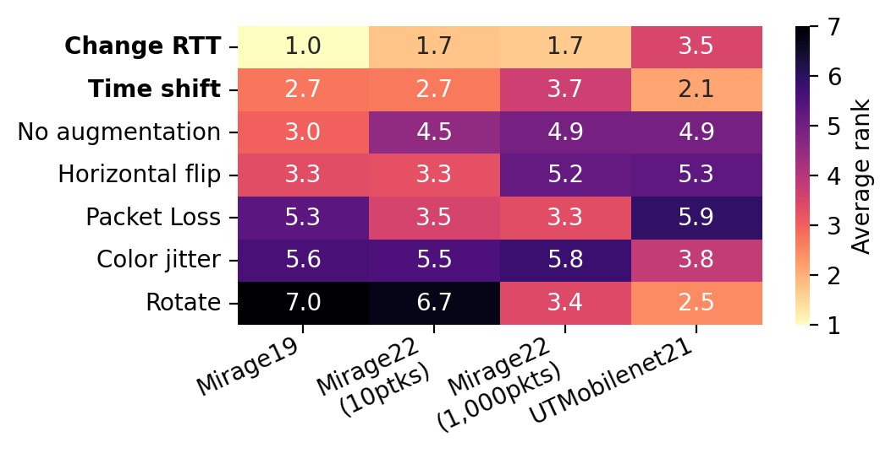

# Figure 7: Average rank obtained per augmentation and dataset.

[:simple-jupyter: :material-download:](../../paper_tables_and_figures/figure7_augmentations_comparison_across_datasets_average_rank/figure7_augmentations_comparison_across_datasets_average_rank.ipynb)


```python
import matplotlib as mpl
import matplotlib.pyplot as plt
import seaborn as sns

%matplotlib inline
%config InlineBackend.figure_format='retina'
```


```python
import autorank
import pandas as pd
```


```python
dat = {
    "mirage19": pd.read_parquet(
        "./campaigns/mirage19/augmentation-at-loading-no-dropout/minpkts10/campaign_summary/augment-at-loading/runsinfo_flowpic_dim_32.parquet"
    ),
    "mirage22_10": pd.read_parquet(
        "./campaigns/mirage22/augmentation-at-loading-no-dropout/minpkts10/campaign_summary/augment-at-loading/runsinfo_flowpic_dim_32.parquet"
    ),
    "mirage22_1000": pd.read_parquet(
        "./campaigns/mirage22/augmentation-at-loading-no-dropout/minpkts1000/campaign_summary/augment-at-loading/runsinfo_flowpic_dim_32.parquet"
    ),
    "utmobile19": pd.read_parquet(
        "./campaigns/utmobilenet21/augmentation-at-loading-no-dropout/minpkts10/campaign_summary/augment-at-loading/runsinfo_flowpic_dim_32.parquet"
    ),
}
```


```python
def prepare_data(df):
    res = df[["hash", "aug_name", "seed", "split_index", "f1"]]
    res.loc[:, "id"] = (
        "split_index"
        + res.loc[:, "split_index"].astype(str)
        + "_seed"
        + res.loc[:, "seed"].astype(str)
    )
    res = res[["aug_name", "id", "f1"]]
    return res.sort_values(["aug_name", "id"])


def get_ranks(df):
    df1 = prepare_data(df)
    df1 = df1.pivot(columns="aug_name", index="id").reset_index(drop=True)
    df1.columns = df1.columns.get_level_values(1)
    new_df = pd.DataFrame(
        {
            "changertt": df1["changertt"].values,
            "colorjitter": df1["colorjitter"].values,
            "horizontalflip": df1["horizontalflip"].values,
            "noaug": df1["noaug"].values,
            "packetloss": df1["packetloss"].values,
            "rotate": df1["rotate"].values,
            "timeshift": df1["timeshift"].values,
        }
    )
    replacement = {
        "noaug": "No augmentation",
        "horizontalflip": "Horizontal flip",
        "rotate": "Rotate",
        "timeshift": "Time shift",
        "colorjitter": "Color jitter",
        "changertt": "Change RTT",
        "packetloss": "Packet Loss",
    }
    new_df = new_df.rename(columns=replacement).dropna()
    rankmat = new_df.rank(axis="columns", ascending=False)
    return rankmat
```


```python
def prepare_ranks_data(dataset):
    res = get_ranks(dat[dataset])
    res["dataset"] = dataset
    return res


together = pd.concat(
    [
        prepare_ranks_data("mirage19"),
        prepare_ranks_data("mirage22_10"),
        prepare_ranks_data("mirage22_1000"),
        prepare_ranks_data("utmobile19"),
    ]
)

df_tmp = pd.melt(
    together, id_vars=["dataset"], var_name="augmentation", value_name="rank"
)
```

    /tmp/ipykernel_13347/159222887.py:3: SettingWithCopyWarning: 
    A value is trying to be set on a copy of a slice from a DataFrame.
    Try using .loc[row_indexer,col_indexer] = value instead
    
    See the caveats in the documentation: https://pandas.pydata.org/pandas-docs/stable/user_guide/indexing.html#returning-a-view-versus-a-copy
      res.loc[:, "id"] = (
    /tmp/ipykernel_13347/159222887.py:3: SettingWithCopyWarning: 
    A value is trying to be set on a copy of a slice from a DataFrame.
    Try using .loc[row_indexer,col_indexer] = value instead
    
    See the caveats in the documentation: https://pandas.pydata.org/pandas-docs/stable/user_guide/indexing.html#returning-a-view-versus-a-copy
      res.loc[:, "id"] = (
    /tmp/ipykernel_13347/159222887.py:3: SettingWithCopyWarning: 
    A value is trying to be set on a copy of a slice from a DataFrame.
    Try using .loc[row_indexer,col_indexer] = value instead
    
    See the caveats in the documentation: https://pandas.pydata.org/pandas-docs/stable/user_guide/indexing.html#returning-a-view-versus-a-copy
      res.loc[:, "id"] = (
    /tmp/ipykernel_13347/159222887.py:3: SettingWithCopyWarning: 
    A value is trying to be set on a copy of a slice from a DataFrame.
    Try using .loc[row_indexer,col_indexer] = value instead
    
    See the caveats in the documentation: https://pandas.pydata.org/pandas-docs/stable/user_guide/indexing.html#returning-a-view-versus-a-copy
      res.loc[:, "id"] = (


```python
df_tmp2
```


<div>
<style scoped>
    .dataframe tbody tr th:only-of-type {
        vertical-align: middle;
    }

    .dataframe tbody tr th {
        vertical-align: top;
    }

    .dataframe thead th {
        text-align: right;
    }
</style>
<table border="1" class="dataframe">
  <thead>
    <tr style="text-align: right;">
      <th>dataset</th>
      <th>mirage19</th>
      <th>mirage22_10</th>
      <th>mirage22_1000</th>
      <th>utmobile19</th>
    </tr>
    <tr>
      <th>augmentation</th>
      <th></th>
      <th></th>
      <th></th>
      <th></th>
    </tr>
  </thead>
  <tbody>
    <tr>
      <th>Change RTT</th>
      <td>1.000000</td>
      <td>1.733333</td>
      <td>1.666667</td>
      <td>3.466667</td>
    </tr>
    <tr>
      <th>Color jitter</th>
      <td>5.600000</td>
      <td>5.533333</td>
      <td>5.800000</td>
      <td>3.800000</td>
    </tr>
    <tr>
      <th>Horizontal flip</th>
      <td>3.333333</td>
      <td>3.266667</td>
      <td>5.200000</td>
      <td>5.266667</td>
    </tr>
    <tr>
      <th>No augmentation</th>
      <td>3.000000</td>
      <td>4.533333</td>
      <td>4.933333</td>
      <td>4.933333</td>
    </tr>
    <tr>
      <th>Packet Loss</th>
      <td>5.333333</td>
      <td>3.533333</td>
      <td>3.333333</td>
      <td>5.933333</td>
    </tr>
    <tr>
      <th>Rotate</th>
      <td>7.000000</td>
      <td>6.733333</td>
      <td>3.400000</td>
      <td>2.466667</td>
    </tr>
    <tr>
      <th>Time shift</th>
      <td>2.733333</td>
      <td>2.666667</td>
      <td>3.666667</td>
      <td>2.133333</td>
    </tr>
  </tbody>
</table>
</div>


```python
df_tmp2 = df_tmp.groupby(["dataset", "augmentation"])["rank"].mean().reset_index()
df_tmp2 = df_tmp2.pivot(index="augmentation", columns="dataset", values="rank")
df_tmp2 = df_tmp2.rename(
    {
        "mirage19": "Mirage19",
        "mirage22_10": "Mirage22\n(10ptks)",
        "mirage22_1000": "Mirage22\n(1,000pkts)",
        "utmobile19": "UTMobilenet21",
    },
    axis=1,
)
df_tmp2 = df_tmp2.sort_values(by="Mirage19", ascending=True)

fig, ax = plt.subplots(figsize=(5, 2.3))
ax = sns.heatmap(
    ax=ax,
    data=df_tmp2,
    annot=True,
    fmt=".1f",
    cmap=plt.get_cmap("magma_r"),
    cbar_kws=dict(label="Average rank"),
)

for lab in ax.get_yticklabels():
    if lab.get_text() in ("Change RTT", "Time shift"):
        lab.set_fontweight("bold")

ax.set_xticklabels(ax.get_xticklabels(), rotation=25, ha="right")
ax.tick_params(axis="x", which="major", pad=0)
ax.set_ylabel(None)
ax.set_xlabel(None)

plt.savefig("augmentations_rank_comparison_together2.png", bbox_inches="tight", dpi=300)
```


    

    

